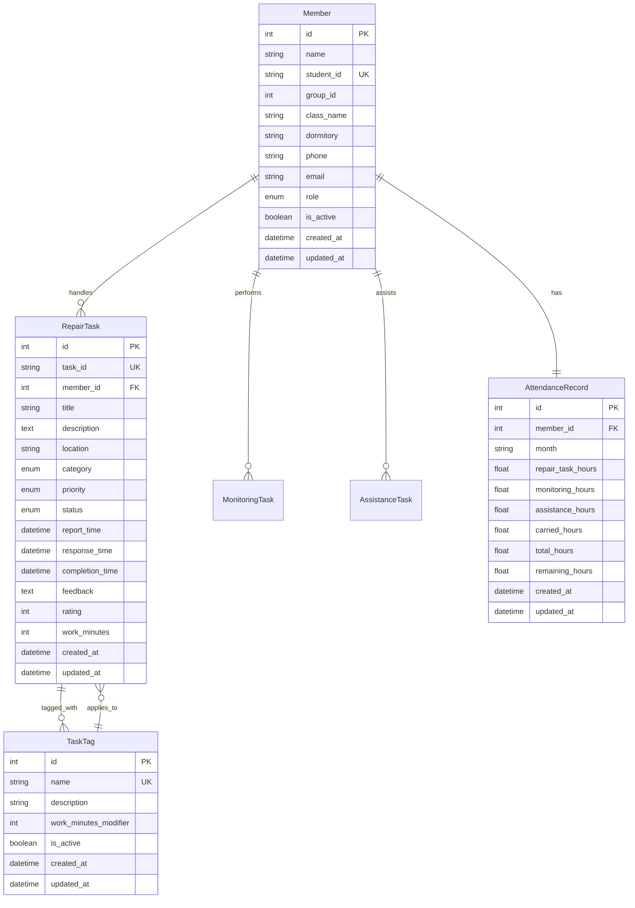

# 考勤管理系统开发文档

## 项目概述

本项目是一个现代化的考勤管理系统，采用前后端分离架构，专为高校网络维护团队设计。系统提供完整的任务管理、工时统计和考勤分析功能。

### 技术架构

```
┌─────────────────┐    ┌─────────────────┐    ┌─────────────────┐
│   Vue 3 Web     │    │  Capacitor App  │    │  Flutter Mobile │
│   (前端界面)     │    │   (跨平台)      │    │   (后期集成)    │
└─────────────────┘    └─────────────────┘    └─────────────────┘
         │                       │                       │
         └───────────────────────┼───────────────────────┘
                                 │
                    ┌─────────────────┐
                    │   FastAPI       │
                    │   (后端API)     │
                    └─────────────────┘
                                 │
                    ┌─────────────────┐
                    │  PostgreSQL     │
                    │   (数据库)      │
                    └─────────────────┘
```

## 技术栈详解

### 后端技术栈

#### 核心框架
- **Python 3.12+**: 推荐使用Python 3.12或3.13最新稳定版本
- **FastAPI 0.104+**: 现代化异步Web框架
  - 自动API文档生成 (Swagger/OpenAPI)
  - 类型提示支持
  - 高性能异步处理
  - 内置数据验证

#### 数据库
- **PostgreSQL 14+**: 主数据库
  - 生产环境: `attendence` (用户: kwok, 密码: Onjuju1084)
  - 开发环境: `attendence_dev` (用户: kwok, 密码: Onjuju1084)
- **SQLAlchemy 2.0**: ORM框架
  - 现代化查询API
  - 异步支持
  - 类型安全

#### 认证与安全
- **JWT (JSON Web Tokens)**: 双令牌认证
  - Access Token: 1小时有效期
  - Refresh Token: 7天有效期
- **Passlib + bcrypt**: 密码哈希
- **AES-256-GCM**: 敏感数据加密
- **HTTPS/TLS 1.2+**: 传输层安全

#### 开发工具
- **uv**: 极速Python包管理和虚拟环境工具
- **Alembic**: 数据库迁移
- **Pytest**: 测试框架
- **Black**: 代码格式化
- **Flake8**: 代码检查
- **mypy**: 类型检查

## 开发环境配置

### 后端开发环境

#### 基础环境要求
- Python 3.12+ / 3.13+（推荐使用pyenv管理版本）
- PostgreSQL 15+
- Redis 7+（可选，用于缓存）
- Git 版本控制
- uv - 现代Python包管理器

#### uv包管理器配置
- **安装uv**：`curl -LsSf https://astral.sh/uv/install.sh | sh` (Linux/macOS) 或 `powershell -c "irm https://astral.sh/uv/install.ps1 | iex"` (Windows)
- **初始化项目**：`uv init` - 创建新项目或在现有项目中初始化
- **创建虚拟环境**：`uv venv` - 自动创建和管理虚拟环境
- **安装依赖**：`uv add package_name` - 添加新依赖
- **同步环境**：`uv sync` - 根据pyproject.toml同步所有依赖
- **运行脚本**：`uv run script_name` - 在虚拟环境中运行脚本

#### 开发工具
- **包管理器**：uv - 极速Python包管理和虚拟环境工具
- **代码格式化**：Black - Python代码格式化
- **代码检查**：Flake8 - 代码质量检查
- **类型检查**：mypy - 静态类型检查
- **测试框架**：Pytest - 单元测试和集成测试
- **数据库迁移**：Alembic - 数据库版本控制
- **API文档**：Swagger/OpenAPI - 自动生成API文档

### 前端开发环境

#### 基础环境要求
- Node.js 18+ / 20+（推荐使用nvm管理版本）
- npm 9+ 或 yarn 3+
- Git 版本控制

#### 开发工具
- **构建工具**：Vite - 快速构建和热重载
- **代码格式化**：Prettier - 代码格式化
- **代码检查**：ESLint - JavaScript/TypeScript代码检查
- **类型检查**：TypeScript - 静态类型检查
- **测试框架**：Vitest - 单元测试，Cypress - E2E测试

## 技术栈详情

### 前端技术栈

#### 核心框架
- **Vue 3**: 渐进式JavaScript框架
  - Composition API
  - TypeScript支持
  - 响应式系统

#### 跨平台开发
- **Capacitor**: 跨平台应用开发
  - iOS/Android原生应用
  - Web应用
  - 原生API访问

#### UI组件库
- **Element Plus**: Vue 3组件库
  - 丰富的组件生态
  - 主题定制
  - 国际化支持
- **备选**: Ant Design Vue

#### 状态管理与工具
- **Pinia**: Vue 3官方状态管理
- **Vue Router**: 路由管理
- **Axios**: HTTP客户端
- **ECharts**: 数据可视化
- **Vite**: 构建工具

#### 开发工具
- **ESLint**: 代码检查
- **Prettier**: 代码格式化
- **Vitest**: 单元测试
- **Cypress**: E2E测试

## 项目结构

### 后端结构

```
backend/
├── app/
│   ├── __init__.py
│   ├── main.py                 # FastAPI应用入口
│   ├── core/                   # 核心配置
│   │   ├── __init__.py
│   │   ├── config.py          # 应用配置
│   │   ├── security.py        # 安全相关
│   │   ├── database.py        # 数据库配置
│   │   └── exceptions.py      # 异常处理
│   ├── api/                    # API路由
│   │   ├── __init__.py
│   │   ├── deps.py            # 依赖注入
│   │   └── v1/                # API版本1
│   │       ├── __init__.py
│   │       ├── auth.py        # 认证路由
│   │       ├── tasks.py       # 任务管理
│   │       ├── members.py     # 成员管理
│   │       └── statistics.py  # 统计分析
│   ├── models/                 # 数据模型
│   │   ├── __init__.py
│   │   ├── base.py            # 基础模型
│   │   ├── member.py          # 成员模型
│   │   ├── task.py            # 任务模型
│   │   └── attendance.py      # 考勤模型
│   ├── schemas/                # Pydantic模式
│   │   ├── __init__.py
│   │   ├── member.py          # 成员模式
│   │   ├── task.py            # 任务模式
│   │   └── attendance.py      # 考勤模式
│   ├── services/               # 业务逻辑
│   │   ├── __init__.py
│   │   ├── auth_service.py    # 认证服务
│   │   ├── task_service.py    # 任务服务
│   │   └── stats_service.py   # 统计服务
│   └── utils/                  # 工具函数
│       ├── __init__.py
│       ├── encryption.py      # 加密工具
│       ├── validators.py      # 验证器
│       └── helpers.py         # 辅助函数
├── tests/                      # 测试文件
│   ├── __init__.py
│   ├── conftest.py            # 测试配置
│   ├── test_auth.py           # 认证测试
│   ├── test_tasks.py          # 任务测试
│   └── test_models.py         # 模型测试
├── alembic/                    # 数据库迁移
│   ├── versions/              # 迁移版本
│   ├── env.py                 # 迁移环境
│   └── alembic.ini            # 迁移配置
├── requirements.txt            # Python依赖
├── requirements-dev.txt        # 开发依赖
├── .env.example               # 环境变量示例
├── Dockerfile                 # Docker配置
└── pyproject.toml             # 项目配置
```

### 前端结构

```
frontend/
├── src/
│   ├── main.ts                # 应用入口
│   ├── App.vue                # 根组件
│   ├── views/                 # 页面视图
│   │   ├── auth/             # 认证页面
│   │   │   ├── Login.vue     # 登录页面
│   │   │   └── Register.vue  # 注册页面
│   │   ├── layout/           # 布局组件
│   │   │   ├── AppLayout.vue # 主布局
│   │   │   ├── Header.vue    # 头部组件
│   │   │   ├── Sidebar.vue   # 侧边栏
│   │   │   └── Footer.vue    # 页脚
│   │   ├── dashboard/        # 仪表盘
│   │   │   └── Dashboard.vue # 系统概览
│   │   ├── tasks/            # 任务管理
│   │   │   ├── TaskList.vue      # 任务列表
│   │   │   ├── TaskDetail.vue    # 任务详情
│   │   │   ├── TaskForm.vue      # 任务表单
│   │   │   └── TaskImport.vue    # 数据导入
│   │   ├── members/          # 成员管理
│   │   │   ├── MemberList.vue    # 成员列表
│   │   │   ├── MemberDetail.vue  # 成员详情
│   │   │   └── MemberForm.vue    # 成员表单
│   │   ├── attendance/       # 考勤管理
│   │   │   ├── CheckIn.vue       # 签到页面
│   │   │   ├── AttendanceList.vue # 考勤记录
│   │   │   └── AttendanceStats.vue # 考勤统计
│   │   ├── statistics/       # 统计分析
│   │   │   ├── Overview.vue      # 系统统计
│   │   │   ├── Reports.vue       # 报表中心
│   │   │   └── WorkHours.vue     # 工时管理
│   │   └── profile/          # 个人中心
│   │       ├── Profile.vue       # 个人信息
│   │       └── Settings.vue      # 系统设置
│   ├── components/            # 通用组件
│   │   ├── common/           # 基础组件
│   │   │   ├── BaseButton.vue    # 按钮组件
│   │   │   ├── BaseCard.vue      # 卡片组件
│   │   │   ├── BaseTable.vue     # 表格组件
│   │   │   ├── BasePagination.vue # 分页组件
│   │   │   ├── BaseDialog.vue    # 对话框组件
│   │   │   ├── BaseUpload.vue    # 上传组件
│   │   │   └── GlobalLoading.vue # 全局加载
│   │   ├── charts/           # 图表组件
│   │   │   ├── LineChart.vue     # 折线图
│   │   │   ├── BarChart.vue      # 柱状图
│   │   │   ├── PieChart.vue      # 饼图
│   │   │   └── StatCard.vue      # 统计卡片
│   │   └── forms/            # 表单组件
│   │       ├── SearchForm.vue    # 搜索表单
│   │       ├── FilterForm.vue    # 筛选表单
│   │       └── DateRangePicker.vue # 日期范围选择
│   ├── stores/               # Pinia状态管理
│   │   ├── index.ts         # Store入口
│   │   ├── global.ts        # 全局状态
│   │   ├── auth.ts          # 认证状态
│   │   ├── user.ts          # 用户状态
│   │   ├── tasks.ts         # 任务状态
│   │   ├── members.ts       # 成员状态
│   │   ├── attendance.ts    # 考勤状态
│   │   └── statistics.ts    # 统计状态
│   ├── router/               # 路由配置
│   │   ├── index.ts         # 路由入口
│   │   ├── guards.ts        # 路由守卫
│   │   └── routes.ts        # 路由定义
│   ├── api/                 # API接口
│   │   ├── index.ts         # API入口
│   │   ├── client.ts        # HTTP客户端
│   │   ├── auth.ts          # 认证接口
│   │   ├── tasks.ts         # 任务接口
│   │   ├── members.ts       # 成员接口
│   │   ├── attendance.ts    # 考勤接口
│   │   └── statistics.ts    # 统计接口
│   ├── utils/                # 工具函数
│   │   ├── index.ts         # 工具入口
│   │   ├── auth.ts          # 认证工具
│   │   ├── storage.ts       # 存储工具
│   │   ├── validators.ts    # 验证器
│   │   ├── formatters.ts    # 格式化器
│   │   ├── constants.ts     # 常量定义
│   │   └── helpers.ts       # 辅助函数
│   ├── types/                # TypeScript类型
│   │   ├── index.ts         # 类型入口
│   │   ├── api.ts           # API类型
│   │   ├── auth.ts          # 认证类型
│   │   ├── common.ts        # 通用类型
│   │   └── models.ts        # 数据模型类型
│   ├── styles/               # 样式文件
│   │   ├── index.scss       # 样式入口
│   │   ├── variables.scss   # SCSS变量
│   │   ├── mixins.scss      # SCSS混入
│   │   ├── reset.scss       # 样式重置
│   │   ├── layout.scss      # 布局样式
│   │   ├── components.scss  # 组件样式
│   │   └── utilities.scss   # 工具样式
│   └── assets/               # 静态资源
│       ├── images/          # 图片资源
│       ├── icons/           # 图标资源
│       └── fonts/           # 字体资源
├── public/                   # 公共资源
│   ├── favicon.ico          # 网站图标
│   ├── manifest.json        # PWA配置
│   └── robots.txt           # 爬虫配置
├── capacitor.config.ts       # Capacitor配置
├── package.json             # 依赖配置
├── vite.config.ts           # Vite配置
├── tsconfig.json            # TypeScript配置
├── .env                     # 环境变量
├── .env.development         # 开发环境变量
├── .env.production          # 生产环境变量
├── .eslintrc.js             # ESLint配置
├── .prettierrc              # Prettier配置
├── .stylelintrc.js          # Stylelint配置
├── vitest.config.ts         # Vitest配置
├── playwright.config.ts     # Playwright配置
└── Dockerfile               # Docker配置
```

## 前端开发计划

### 第一阶段：基础架构搭建 (高优先级)
1. **项目初始化和配置**
   - ✅ Vue 3 + Vite + TypeScript 基础配置
   - ✅ Element Plus UI组件库集成
   - ✅ 样式系统和设计规范建立
   - ✅ 环境变量和构建配置

2. **核心系统架构**
   - 🔄 Pinia状态管理配置
   - 🔄 Vue Router路由系统
   - 🔄 Axios HTTP客户端和拦截器
   - 🔄 身份认证系统和路由守卫

3. **基础布局组件**
   - 主应用布局 (Header/Sidebar/Footer)
   - 响应式设计适配
   - 导航和菜单系统

### 第二阶段：核心功能开发 (中优先级)
4. **仪表板页面**
   - 系统概览统计
   - 数据可视化图表
   - 实时数据展示

5. **任务管理模块**
   - 任务列表和筛选
   - 任务详情和编辑
   - 任务表单组件
   - 工时计算和管理

6. **成员管理模块**
   - 成员列表和CRUD操作
   - 角色权限管理
   - 成员信息详情

7. **考勤管理模块**
   - 签到/签退功能
   - 考勤记录查询
   - 考勤统计分析

8. **统计报表模块**
   - 数据统计图表
   - 报表生成和导出
   - 月度/年度报表

### 第三阶段：高级功能和优化 (低优先级)
9. **数据导入功能**
   - Excel文件上传
   - 数据预览和验证
   - 批量导入处理

10. **移动端适配**
    - 响应式设计优化
    - 移动端交互适配
    - Capacitor移动应用配置

11. **测试和部署**
    - 单元测试编写
    - E2E测试配置
    - 生产环境部署配置
    - 性能优化和代码分割

## 业务逻辑与规则

### 任务类型定义与工时折算

所有考勤任务以"分钟"为最小单位进行计算，统一转换为小时（精确到 0.1 小时）。

#### 报修任务（Wireless Repair Task）

| 任务标签    | 工时折算           | 说明                |
| ------- | -------------- | ----------------- |
| 线上任务    | 40 分钟 / 单      | 不需现场到场处理的工单       |
| 线下任务    | 100 分钟 / 单     | 需到场检测或维修的工单       |
| 爆单任务    | 15 分钟 / 单（附加）  | 管理员手动标记为"爆单"      |
| 非默认好评任务 | +30 分钟 / 单（附加） | 用户主动给予评价视为"非默认好评" |

> 注：单个任务可拥有**多个标签**，其工时将**累计计算**。如"线下任务 + 爆单 + 非默认好评"总计：100 + 15 + 30 = **145 分钟**

#### 考勤异常扣时逻辑

以下规则适用于所有由系统自动识别的异常工单：

| 异常类型  | 影响范围   | 扣时规则                    |
| ----- | ------ | ----------------------- |
| 超时响应单 | 组内所有成员 | -30 分钟 / 单 / 人（响应 >24h） |
| 超时处理单 | 实际处理人  | -30 分钟 / 人（处理 >48h）     |
| 差评单   | 组内所有成员 | -60 分钟 / 单 / 人（用户反馈为差评） |

所有惩罚按月度合并扣除，负工时将直接影响个人总工时汇总。

#### 日常监控任务考勤逻辑

**原逻辑说明**：原"默认每日10小时监控"逻辑已取消。

**新逻辑处理方式**：

| 类别   | 说明                       |
| ---- | ------------------------ |
| 巡检任务 | 归类为日常监控，由人员**手动登记时长**    |
| 网络巡查 | 登记人员选择任务类型为"日常监控"，并填写时间段 |
| 任务发起 | 仅具备相应权限的用户可登记            |

登记内容字段要求：

| 字段名  | 类型    | 说明            |
| ---- | ----- | ------------- |
| 登记人  | 姓名/ID | 执行该任务的成员      |
| 起止时间 | 时间戳   | 必填，精确到分钟      |
| 任务说明 | 字符串   | 巡检内容、检测位置等    |
| 所属类别 | 枚举    | 巡检、日常维护、异常检测等 |

### 任务数据导入与自动识别逻辑

#### 导入表格说明

系统支持导入两类表格：

| 表格类型       | 说明                       |
| ---------- | ------------------------ |
| A表：报修单数据   | 原始报修记录，包含报修人、联系方式、时间、地点等 |
| B表：校园网维护记录 | 实际处理登记，包括检修形式、检修内容、负责人等  |

#### 匹配流程说明

1. 系统以【报修人姓名 + 联系方式】为**关键字段**，对 A、B 表进行一对一匹配；
2. 匹配成功后，系统自动：
   * 读取 B 表中的 `检修形式` 字段 → 判断线上 / 线下任务；
   * 读取 `字段A` → 作为检修说明，自动写入任务描述；
   * 标记任务属性（线上 / 线下），参与考勤计算；
3. 无法匹配的数据标记为"未匹配记录"，标记对应字段后，反馈给管理员，A表中的报修单如果在B表中匹配不到，则默认为线上单。

> ⚠️ 建议字段内容一致性需高，例如联系人名建议采用中文全名，避免同名冲突。

### 爆单任务标记机制

爆单任务需要由管理员在系统后台手动标记，当前支持：

| 标记方式      | 说明                             |
| --------- | ------------------------------ |
| 按日期批量选择   | 选择具体日期区间，勾选目标报修任务              |
| 按字段筛选     | 如字段A包含"多个地点"、工单密集等特征           |
| 后续拓展（规划中） | 支持从 Excel 导入批量标记、或通过模型辅助识别爆单工单 |

> 管理员标记后任务自动加上"爆单"标签，计入考勤。

### 工时字段定义与存储结构

最终每条任务将根据标签打分，写入以下考勤字段：

| 字段名                 | 含义             |
| ------------------- | -------------- |
| `repair_task_hours` | 本月报修任务累计时长（小时） |
| `monitoring_hours`  | 本月监控任务累计时长（小时） |
| `assistance_hours`  | 本月协助任务累计时长（小时） |
| `carried_hours`     | 上月结转的剩余时长（小时）  |
| `total_hours`       | 实际总工时（小时）      |
| `remaining_hours`   | 扣除后可结转至下月的剩余工时 |

## 数据模型设计

### 核心实体关系



### 模型设计要点

#### Member (成员模型)
- **核心字段**: 姓名、学号、组别、班级、宿舍、联系方式
- **安全考虑**: 敏感信息（宿舍、电话）需加密存储
- **关系**: 一对多关联报修任务和考勤记录
- **索引**: 学号唯一索引，提高查询性能

#### RepairTask (报修任务模型)
- **核心字段**: 任务ID、标题、描述、位置、类别、状态、时间节点
- **时间管理**: 报修时间、响应时间、完成时间
- **评价系统**: 用户反馈、评分（1-5星）
- **工时计算**: 基于标签和规则自动计算工时
- **业务逻辑**:
  - 超时判断：响应>24h，完成>48h
  - 多标签支持：一个任务可有多个标签
  - 状态流转：待处理→处理中→已完成

#### TaskTag (任务标签模型)
- **标签管理**: 线上任务、线下任务、爆单任务、好评任务等
- **工时修正**: 每个标签对应不同的工时加减值
- **多对多关系**: 任务与标签的关联表设计
- **状态控制**: 支持标签的启用/禁用

#### MonitoringTask (监控任务模型)
- **手动登记**: 支持人员手动录入巡检任务
- **时间记录**: 精确到分钟的起止时间
- **分类管理**: 巡检、日常维护、异常检测等类别
- **权限控制**: 仅授权用户可创建监控任务

#### AttendanceRecord (考勤记录模型)
- **月度统计**: 按月汇总各类任务工时
- **工时分类**: 报修、监控、协助、结转工时
- **计算结果**: 总工时、剩余工时自动计算
- **历史追踪**: 保留每月考勤计算历史

## 业务逻辑实现指南

### 工时计算核心算法

#### 计算流程设计
1. **基础工时计算**
   - 线上任务：40分钟/单
   - 线下任务：100分钟/单
   - 根据任务类别确定基础工时

2. **标签修正计算**
   - 遍历任务关联的所有标签
   - 累加每个标签的工时修正值
   - 支持正负修正（加分/扣分）

3. **异常扣时处理**
   - 超时响应：响应时间>24小时，扣30分钟
   - 超时完成：完成时间>48小时，扣30分钟
   - 差评处理：评分≤2星，扣60分钟

4. **奖励工时计算**
   - 爆单任务：管理员标记，+15分钟
   - 非默认好评：真实用户评价，+30分钟

5. **总工时计算**
   - 公式：max(0, 基础工时 + 标签修正 + 异常扣时 + 奖励工时)
   - 确保最终工时不为负数

#### 非默认好评判断逻辑
- **排除条件**：
  - 包含"系统默认好评"等关键词
  - 评价内容少于3个字符
  - 评分低于4星
- **认定条件**：
  - 用户主动填写评价内容
  - 评价内容具有实际意义
  - 评分4星及以上

### 考勤统计服务设计

#### 月度考勤计算流程
1. **数据收集**
   - 获取指定月份的所有任务记录
   - 包括报修任务、监控任务、协助任务
   - 获取上月结转工时

2. **分类统计**
   - 报修任务工时：基于标签和规则计算
   - 监控任务工时：手动登记的时长
   - 协助任务工时：协助他人完成的任务
   - 异常扣时：各类超时和差评扣时

3. **工时汇总**
   - 计算各类任务总工时
   - 加上上月结转工时
   - 扣除异常扣时
   - 生成月度考勤记录

4. **结果保存**
   - 更新AttendanceRecord表
   - 记录计算详情和时间戳
   - 支持历史记录查询

### 数据导入与匹配服务

#### Excel数据导入流程
1. **文件解析**
   - 支持.xlsx和.xls格式
   - 验证表格结构和必填字段
   - 数据类型校验和格式化

2. **数据匹配算法**
   - 主键匹配：报修人姓名 + 联系方式
   - 模糊匹配：处理姓名变体和格式差异
   - 冲突处理：多条匹配时的优先级规则

3. **任务分类识别**
   - 根据"检修形式"字段判断线上/线下
   - 自动标记任务类别
   - 生成任务描述和位置信息

4. **异常处理**
   - 未匹配记录标记和报告
   - 数据质量检查和提示
   - 支持手动调整和重新匹配

### 权限与安全控制

#### 用户权限设计
- **普通成员**：查看个人考勤，登记监控任务
- **组长**：管理组内成员，审核任务记录
- **管理员**：系统配置，数据导入，爆单标记
- **超级管理员**：用户管理，系统维护

#### 数据安全措施
- **敏感信息加密**：宿舍、电话等个人信息
- **操作日志记录**：所有数据修改操作
- **访问控制**：基于角色的权限验证
- **数据备份**：定期备份和恢复机制
```

## API设计规范

### RESTful API设计原则

1. **资源导向**: URL表示资源，HTTP方法表示操作
2. **状态码规范**: 正确使用HTTP状态码
3. **版本控制**: 通过URL路径进行版本控制 (`/api/v1/`)
4. **统一响应格式**: 所有API返回统一的JSON格式
5. **分页支持**: 列表接口支持分页参数（page、size、sort）
6. **过滤查询**: 支持多条件过滤和搜索
7. **错误处理**: 详细的错误码和错误信息

### API模块设计

#### 认证模块（/api/v1/auth/）
- 用户登录、登出、令牌刷新
- JWT令牌管理和验证
- 权限验证中间件

#### 成员管理（/api/v1/members/）
- 成员信息CRUD操作
- 成员权限管理
- 成员状态管理

#### 任务管理（/api/v1/tasks/）
- 报修任务管理（增删改查）
- 监控任务管理
- 协助任务管理
- 任务批量导入和导出
- 任务状态流转

#### 考勤统计（/api/v1/attendance/）
- 成员月度考勤计算
- 工时统计和分析
- 考勤数据导出
- 历史数据查询

#### 系统管理（/api/v1/system/）
- 系统配置管理
- 数据备份和恢复
- 日志查询和管理

## 安全实现

### 认证与授权

#### JWT双令牌机制
- **访问令牌（Access Token）**：短期有效（1小时），用于API访问
- **刷新令牌（Refresh Token）**：长期有效（7天），用于获取新的访问令牌
- **令牌存储**：访问令牌存储在内存，刷新令牌存储在HttpOnly Cookie
- **自动刷新**：前端自动检测令牌过期并刷新

#### 密码安全
- **哈希算法**：使用bcrypt进行密码哈希
- **盐值处理**：每个密码使用唯一盐值
- **密码策略**：强制密码复杂度要求
- **登录保护**：失败次数限制和账户锁定

#### 权限控制
- **基于角色的访问控制（RBAC）**：管理员、普通成员等角色
- **API权限验证**：每个接口验证用户权限
- **数据权限隔离**：成员只能访问自己的数据
- **操作审计**：记录关键操作日志

### 数据安全

#### 数据加密
- **传输加密**：HTTPS/TLS 1.3协议
- **存储加密**：敏感数据使用AES-256-GCM加密
- **密钥管理**：使用PBKDF2进行密钥派生
- **加密范围**：个人信息、敏感配置等

#### 数据完整性
- **输入验证**：严格的参数验证和过滤
- **SQL注入防护**：使用ORM参数化查询
- **XSS防护**：输出编码和CSP策略
- **CSRF防护**：CSRF令牌验证

### 系统安全

#### 环境配置
- **环境变量**：敏感配置通过环境变量管理
- **配置分离**：开发、测试、生产环境配置分离
- **密钥轮换**：定期更换加密密钥
- **安全头部**：设置安全相关的HTTP头部

#### 监控与审计
- **访问日志**：记录所有API访问
- **异常监控**：监控异常登录和操作
- **性能监控**：API响应时间和错误率
- **安全扫描**：定期进行安全漏洞扫描

## 测试策略

### 测试层次架构

#### 后端测试
- **单元测试**：业务逻辑、数据模型、工具函数
- **集成测试**：API接口、数据库操作、服务集成
- **端到端测试**：完整业务流程验证
- **性能测试**：负载测试、并发测试

#### 前端测试
- **组件测试**：Vue组件单元测试
- **页面测试**：完整页面功能测试
- **用户流程测试**：关键业务场景
- **跨平台测试**：Web、iOS、Android兼容性

### 测试覆盖要求

#### 核心业务逻辑
- **工时计算算法**：100%覆盖率
- **考勤统计逻辑**：100%覆盖率
- **数据导入匹配**：100%覆盖率
- **权限验证机制**：100%覆盖率

#### API接口测试
- **认证授权**：登录、令牌刷新、权限验证
- **任务管理**：CRUD操作、批量导入、状态流转
- **考勤统计**：月度计算、数据查询、报表生成
- **系统管理**：配置管理、数据备份

#### 异常场景测试
- **数据验证**：非法输入、边界值测试
- **错误处理**：网络异常、数据库异常
- **安全测试**：SQL注入、XSS攻击防护
- **并发测试**：多用户同时操作

### 测试工具与框架

#### 后端测试工具
- **pytest**：测试框架和用例管理
- **TestClient**：FastAPI接口测试
- **factory_boy**：测试数据生成
- **coverage**：代码覆盖率统计

#### 前端测试工具
- **Vitest**：Vue生态测试框架
- **Vue Test Utils**：组件测试工具
- **Cypress**：端到端测试
- **Playwright**：跨浏览器测试

### 测试数据管理

#### 数据策略
- **测试数据库**：独立的PostgreSQL测试环境
- **数据隔离**：每个测试用例独立数据
- **数据清理**：测试后自动清理
- **数据工厂**：标准化测试数据生成

#### 测试环境
- **本地测试**：开发者本地测试环境
- **CI/CD测试**：自动化持续集成测试
- **预发布测试**：生产环境模拟测试
- **性能测试**：专用性能测试环境

## 详细实施计划与任务清单

### 🚀 Phase 1: 核心后端实现 (第1-2周)

#### 1.1 API路由系统 (优先级: 🔥 极高)
**文件位置**: `backend/app/api/v1/`

- [ ] **认证路由** (`auth.py`)
  - `POST /api/v1/auth/login` - 用户登录
  - `POST /api/v1/auth/refresh` - 刷新令牌
  - `POST /api/v1/auth/logout` - 用户登4；g出
  - `GET /api/v1/auth/me` - 获取当前用户信息
  - `PUT /api/v1/auth/change-password` - 修改密码

- [ ] **成员管理路由** (`members.py`)
  - `GET /api/v1/members` - 成员列表（分页、搜索、过滤）
  - `POST /api/v1/members` - 创建新成员
  - `GET /api/v1/members/{id}` - 获取成员详情
  - `PUT /api/v1/members/{id}` - 更新成员信息
  - `DELETE /api/v1/members/{id}` - 删除成员
  - `PUT /api/v1/members/{id}/role` - 修改成员角色

- [ ] **任务管理路由** (`tasks.py`)
  - `GET /api/v1/tasks/repair` - 报修任务列表
  - `POST /api/v1/tasks/repair` - 创建报修任务
  - `GET /api/v1/tasks/repair/{id}` - 报修任务详情
  - `PUT /api/v1/tasks/repair/{id}` - 更新报修任务
  - `POST /api/v1/tasks/repair/import` - 批量导入报修数据
  - `POST /api/v1/tasks/repair/{id}/tags` - 添加任务标签
  - `GET /api/v1/tasks/monitoring` - 监控任务列表
  - `POST /api/v1/tasks/monitoring` - 创建监控任务

- [ ] **考勤统计路由** (`attendance.py`)
  - `GET /api/v1/attendance/overview` - 考勤总览
  - `GET /api/v1/attendance/members/{id}` - 成员考勤详情
  - `POST /api/v1/attendance/calculate` - 计算月度考勤
  - `GET /api/v1/attendance/export` - 导出考勤报表
  - `GET /api/v1/attendance/statistics` - 考勤统计分析

#### 1.2 Pydantic 数据模式 (优先级: 🔥 极高)
**文件位置**: `backend/app/schemas/`

- [ ] **认证模式** (`auth.py`)
  - `LoginRequest`, `LoginResponse`, `TokenResponse`
  - `RefreshTokenRequest`, `ChangePasswordRequest`
  - `UserProfileResponse`

- [ ] **成员模式** (`member.py`)
  - `MemberCreate`, `MemberUpdate`, `MemberResponse`
  - `MemberListResponse`, `MemberDetailResponse`
  - `MemberRoleUpdate`, `MemberSearchParams`

- [ ] **任务模式** (`task.py`)
  - `RepairTaskCreate`, `RepairTaskUpdate`, `RepairTaskResponse`
  - `MonitoringTaskCreate`, `AssistanceTaskCreate`
  - `TaskTagCreate`, `TaskImportRequest`
  - `TaskListParams`, `TaskStatistics`

- [ ] **考勤模式** (`attendance.py`)
  - `AttendanceRecordResponse`, `AttendanceCalculateRequest`
  - `AttendanceOverviewResponse`, `AttendanceExportParams`
  - `WorkHoursBreakdown`, `MonthlyStatistics`

#### 1.3 业务逻辑服务 (优先级: 🔥 极高)
**文件位置**: `backend/app/services/`

- [ ] **认证服务** (`auth_service.py`)
  - 用户登录验证
  - JWT令牌生成和验证
  - 密码哈希和验证
  - 权限检查装饰器
  - 会话管理

- [ ] **任务服务** (`task_service.py`)
  - 任务CRUD操作
  - 工时计算逻辑
  - 任务状态流转
  - 标签管理
  - 超时检测

- [ ] **统计服务** (`stats_service.py`)
  - 月度考勤计算
  - 工时统计分析
  - 数据聚合
  - 报表生成
  - 趋势分析

- [ ] **数据导入服务** (`import_service.py`)
  - Excel文件解析
  - A/B表匹配算法
  - 数据验证和清洗
  - 批量导入处理
  - 错误处理和回滚

#### 1.4 基础设施组件 (优先级: 🔥 高)

- [ ] **依赖注入** (`api/deps.py`)
  - 数据库会话管理
  - 当前用户获取
  - 权限验证依赖
  - 分页参数处理

- [ ] **环境配置**
  - `.env.example` 文件
  - 开发/测试/生产环境配置
  - 数据库连接配置
  - 安全密钥管理

- [ ] **加密工具** (`utils/encryption.py`)
  - AES-256-GCM加密/解密
  - 密钥派生函数
  - 敏感数据处理
  - 安全工具函数

### 🎨 Phase 2: 前端核心实现 (第2-3周)

#### 2.1 项目基础设置 (优先级: 🔥 极高)

- [ ] **依赖包配置** (`frontend/package.json`)
```json
{
  "dependencies": {
    "vue": "^3.4.0",
    "@capacitor/core": "^5.0.0",
    "@capacitor/cli": "^5.0.0",
    "element-plus": "^2.4.0",
    "pinia": "^2.1.0",
    "vue-router": "^4.2.0",
    "axios": "^1.6.0",
    "echarts": "^5.4.0",
    "@vueuse/core": "^10.5.0"
  }
}
```

- [ ] **Vite配置** (`vite.config.ts`)
  - 开发服务器代理配置
  - 构建优化设置
  - 插件配置（Vue, TypeScript）
  - 路径别名设置

- [ ] **TypeScript配置** (`tsconfig.json`)
  - 严格类型检查
  - 路径映射
  - Vue组件类型支持

#### 2.2 核心系统实现 (优先级: 🔥 极高)

- [ ] **路由系统** (`src/router/index.ts`)
  - 路由定义和嵌套路由
  - 导航守卫（认证检查）
  - 权限路由过滤
  - 动态路由加载

- [ ] **状态管理** (`src/stores/`)
  - `auth.ts` - 认证状态（用户信息、令牌管理）
  - `tasks.ts` - 任务状态（任务列表、过滤条件）
  - `members.ts` - 成员状态（成员列表、当前成员）
  - `attendance.ts` - 考勤状态（统计数据、导出状态）

- [ ] **API客户端** (`src/utils/api.ts`)
  - Axios实例配置
  - 请求/响应拦截器
  - 错误处理机制
  - 令牌自动刷新
  - 接口类型定义

#### 2.3 UI组件开发 (优先级: 🔥 高)

- [ ] **基础组件** (`src/components/common/`)
  - `BaseButton.vue` - 统一按钮组件
  - `BaseCard.vue` - 卡片容器组件
  - `BaseTable.vue` - 数据表格组件
  - `BaseForm.vue` - 表单基础组件
  - `BasePagination.vue` - 分页组件

- [ ] **认证组件** (`src/components/auth/`)
  - `LoginForm.vue` - 登录表单
  - `PasswordChangeForm.vue` - 密码修改表单

### 🔧 Phase 3: 功能模块实现 (第3-4周)

#### 3.1 任务管理模块 (优先级: 🔥 高)

- [ ] **任务组件** (`src/views/Tasks/`)
  - `TaskList.vue` - 任务列表页面
  - `TaskDetail.vue` - 任务详情页面
  - `TaskForm.vue` - 任务创建/编辑表单
  - `TaskImport.vue` - 批量导入页面

- [ ] **任务子组件** (`src/components/tasks/`)
  - `TaskCard.vue` - 任务卡片
  - `TaskFilter.vue` - 任务过滤器
  - `TaskStatusBadge.vue` - 状态标签
  - `WorkHoursCalculator.vue` - 工时计算器

#### 3.2 成员管理模块 (优先级: 🔥 中)

- [ ] **成员组件** (`src/views/Members/`)
  - `MemberList.vue` - 成员列表页面
  - `MemberDetail.vue` - 成员详情页面
  - `MemberForm.vue` - 成员信息表单

#### 3.3 统计分析模块 (优先级: 🔥 中)

- [ ] **统计组件** (`src/views/Statistics/`)
  - `Overview.vue` - 统计总览页面
  - `Reports.vue` - 报表页面
  - `Charts.vue` - 图表展示页面

- [ ] **图表组件** (`src/components/charts/`)
  - `LineChart.vue` - 趋势图
  - `BarChart.vue` - 柱状图
  - `PieChart.vue` - 饼图

### 🛠️ Phase 4: 系统集成与测试 (第4-5周)

#### 4.1 后端测试 (优先级: 🔥 中)

- [ ] **单元测试** (`backend/tests/`)
  - `test_auth.py` - 认证功能测试
  - `test_tasks.py` - 任务管理测试
  - `test_models.py` - 数据模型测试
  - `test_services.py` - 业务逻辑测试

- [ ] **集成测试**
  - API端点测试
  - 数据库操作测试
  - 工时计算测试
  - 数据导入测试

#### 4.2 前端测试 (优先级: 🔥 中)

- [ ] **组件测试**
  - Vue组件单元测试
  - 用户交互测试
  - 状态管理测试

- [ ] **端到端测试**
  - 用户登录流程
  - 任务管理流程
  - 数据导入流程

### 🚀 Phase 5: 部署与优化 (第5-6周)

#### 5.1 容器化部署 (优先级: 🔥 中)

- [ ] **Docker配置**
  - `backend/Dockerfile` - 后端容器
  - `frontend/Dockerfile` - 前端容器
  - `backend/docker-compose.yml` - 后端开发环境编排
  - `docker-compose.prod.yml` - 生产环境编排

#### 5.2 系统优化 (优先级: 🔥 低)

- [ ] **性能优化**
  - 数据库查询优化
  - 前端代码分割
  - 图片和资源优化
  - 缓存策略实现

- [ ] **安全加固**
  - CORS策略配置
  - CSP安全头设置
  - 输入验证强化
  - 速率限制实现

## 实施进度追踪

### 每日进度更新模板

```markdown
### YYYY-MM-DD 进度报告

#### ✅ 已完成
- [ ] 任务描述

#### 🚧 进行中
- [ ] 任务描述 (预计完成时间)

#### 🚫 遇到的问题
- 问题描述和解决方案

#### 📋 明日计划
- [ ] 任务描述
```

### 里程碑检查点

- **Week 1 End**: 后端API基础完成，可通过Swagger测试
- **Week 2 End**: 前端基础框架完成，认证系统可用
- **Week 3 End**: 任务管理核心功能完成
- **Week 4 End**: 统计分析功能完成，系统基本可用
- **Week 5 End**: 测试覆盖完成，部署就绪
- **Week 6 End**: 项目完成，文档齐全

## 部署指南

### 部署方式

#### 传统服务器部署
- **系统要求**：Ubuntu 20.04+ / CentOS 8+ / Windows Server 2019+
- **Python环境**：Python 3.12+ 或 3.13+，推荐使用pyenv管理版本
- **数据库安装**：PostgreSQL 14+ 独立安装和配置
- **Web服务器**：Nginx + Gunicorn/Uvicorn 部署方案
- **进程管理**：Systemd服务管理或PM2进程守护
- **依赖管理**：使用uv、pip + requirements.txt 或 Poetry

#### 虚拟环境部署
- **Python虚拟环境**：uv、venv 或 conda 环境隔离
- **依赖安装**：uv sync 或 pip install -r requirements.txt
- **环境变量**：.env文件或系统环境变量配置
- **数据库连接**：本地或远程PostgreSQL实例
- **静态文件服务**：Nginx配置静态资源代理

#### 云平台部署
- **PaaS平台**：Heroku、Railway、Render等平台部署
- **云服务器**：阿里云ECS、腾讯云CVM、AWS EC2等
- **托管数据库**：云数据库PostgreSQL服务
- **CDN加速**：静态资源CDN分发
- **负载均衡**：云负载均衡器配置

#### Docker容器化部署
- **后端容器**：基于Python 3.12+镜像，包含FastAPI应用和依赖
- **前端容器**：基于Node.js构建，使用Nginx提供静态文件服务
- **数据库容器**：PostgreSQL 14官方镜像
- **缓存容器**：Redis 7官方镜像
- **编排工具**：Docker Compose 或 Kubernetes
- **容器优化**：多阶段构建、非root用户、健康检查

#### Kubernetes集群部署
- **容器编排**：K8s Deployment、Service、Ingress配置
- **配置管理**：ConfigMap和Secret管理
- **存储管理**：PersistentVolume数据持久化
- **服务发现**：内部服务通信和负载均衡
- **自动扩缩容**：HPA水平自动扩缩容配置

#### Docker Compose编排
- **服务定义**：数据库、缓存、后端API、前端应用
- **网络配置**：内部网络隔离和端口映射
- **数据持久化**：数据库数据卷和文件上传目录
- **环境变量**：统一的环境配置管理

### 生产环境部署

#### 环境配置
- **环境变量管理**：敏感信息通过环境变量配置
- **配置分离**：开发、测试、生产环境配置分离
- **密钥管理**：JWT密钥、数据库密码等安全配置
- **日志配置**：结构化日志和日志轮转

#### 反向代理配置
- **Nginx配置**：反向代理、负载均衡、SSL终止
- **HTTPS配置**：SSL证书配置和安全策略
- **静态文件服务**：前端资源缓存和压缩
- **API代理**：后端API请求转发和超时配置

#### 安全配置
- **SSL/TLS**：HTTPS强制跳转和安全头部
- **防火墙规则**：端口访问控制
- **访问控制**：IP白名单和访问限制
- **安全扫描**：定期安全漏洞扫描

### 监控与维护

#### 应用监控
- **性能监控**：API响应时间、吞吐量、错误率
- **资源监控**：CPU、内存、磁盘、网络使用情况
- **业务监控**：用户活跃度、功能使用统计
- **告警机制**：异常情况自动告警

#### 日志管理
- **集中化日志**：应用日志、访问日志、错误日志
- **日志分析**：日志聚合和分析工具
- **日志轮转**：自动日志清理和归档
- **审计日志**：关键操作记录和追踪

#### 备份策略
- **数据库备份**：定期自动备份和恢复测试
- **文件备份**：上传文件和配置文件备份
- **备份验证**：备份完整性验证
- **灾难恢复**：快速恢复方案和演练

### 扩展与优化

#### 性能优化
- **数据库优化**：索引优化、查询优化、连接池配置
- **缓存策略**：Redis缓存、应用缓存、CDN加速
- **代码优化**：异步处理、批量操作、资源复用
- **前端优化**：代码分割、懒加载、资源压缩

#### 水平扩展
- **负载均衡**：多实例部署和负载分发
- **数据库扩展**：读写分离、分库分表
- **微服务架构**：服务拆分和独立部署
- **容器编排**：Kubernetes集群管理

#### 持续集成/持续部署
- **CI/CD流水线**：自动化构建、测试、部署
- **版本管理**：Git分支策略和版本发布
- **自动化测试**：单元测试、集成测试、端到端测试
- **蓝绿部署**：零停机时间部署策略
