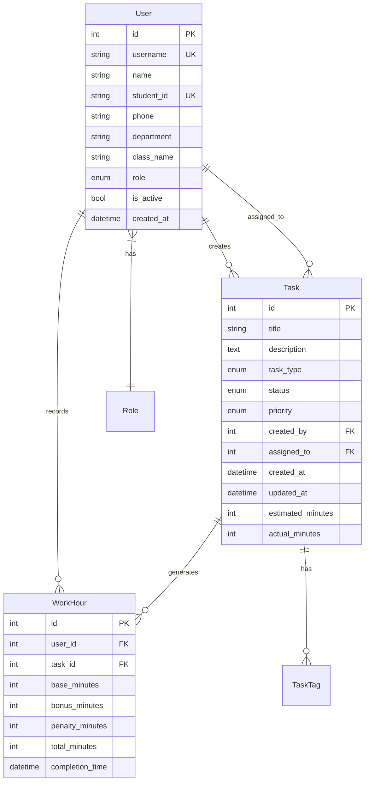
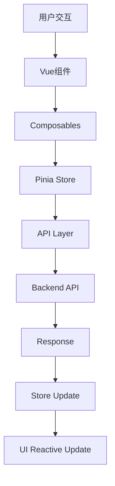
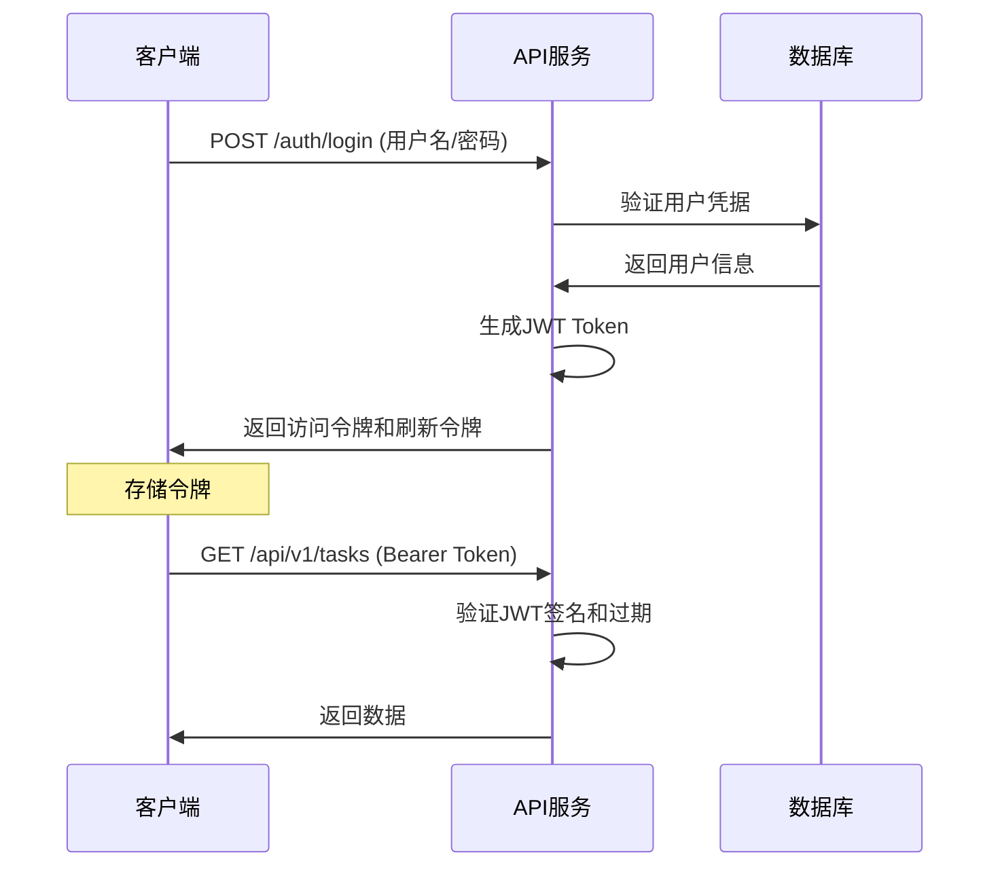

# 🏗️ 系统架构说明

## 📋 架构概览

考勤管理系统采用现代化的前后端分离架构，基于微服务设计理念，提供高可用、可扩展的解决方案。

```
┌─────────────────┐    ┌─────────────────┐    ┌─────────────────┐
│   Frontend      │    │   Backend API   │    │   Database      │
│   Vue 3 + TS    │◄──►│   FastAPI       │◄──►│  PostgreSQL     │
│   + Vite        │    │   + SQLAlchemy  │    │  + Redis        │
└─────────────────┘    └─────────────────┘    └─────────────────┘
```

## 🎯 设计原则

### 核心原则

1. **职责分离** - 前后端完全解耦，API优先设计
2. **数据一致性** - 统一的数据模型和响应格式
3. **类型安全** - TypeScript + Pydantic 提供全栈类型安全
4. **可观测性** - 完整的日志、监控和错误追踪
5. **可扩展性** - 模块化设计，支持水平扩展

### 技术选型理由

| 技术 | 选择理由 |
|------|----------|
| **FastAPI** | 高性能、自动API文档生成、类型安全 |
| **Vue 3** | 渐进式框架、组合式API、优秀的TypeScript支持 |
| **SQLAlchemy** | 强大的ORM、支持多数据库、迁移管理 |
| **PostgreSQL** | 关系型数据库、ACID特性、JSON支持 |
| **Redis** | 高性能缓存、会话存储、消息队列 |
| **JWT** | 无状态认证、跨域友好、可扩展 |

## 🏢 后端架构

### 📁 目录结构

```
backend/
├── app/
│   ├── api/                    # API路由层
│   │   └── v1/                # API版本1
│   │       ├── auth.py        # 认证相关
│   │       ├── members.py     # 成员管理
│   │       ├── tasks.py       # 任务管理
│   │       ├── statistics.py  # 统计分析
│   │       └── attendance.py  # 考勤管理
│   ├── core/                   # 核心配置
│   │   ├── config.py          # 应用配置
│   │   ├── database.py        # 数据库连接
│   │   ├── security.py        # 安全相关
│   │   └── cache.py           # 缓存管理
│   ├── models/                 # 数据模型
│   │   ├── user.py            # 用户模型
│   │   ├── task.py            # 任务模型
│   │   └── attendance.py      # 考勤模型
│   ├── schemas/                # Pydantic模式
│   │   ├── user.py            # 用户Schema
│   │   ├── task.py            # 任务Schema
│   │   └── base.py            # 基础Schema
│   ├── services/               # 业务逻辑层
│   │   ├── auth.py            # 认证服务
│   │   ├── member.py          # 成员服务
│   │   └── task.py            # 任务服务
│   └── utils/                  # 工具函数
│       ├── deps.py            # 依赖注入
│       └── exceptions.py      # 异常处理
├── alembic/                    # 数据库迁移
├── tests/                      # 测试文件
└── scripts/                    # 脚本工具
```

### 🔄 请求处理流程


### 🛡️ 安全架构

1. **认证层**: JWT Token + 刷新机制
2. **授权层**: 基于角色的访问控制 (RBAC)
3. **数据层**: SQL注入防护 + 参数化查询
4. **传输层**: HTTPS + CORS策略
5. **输入层**: Pydantic验证 + XSS防护

### 📊 数据层设计

#### 核心实体关系



## 🖥️ 前端架构

### 📁 目录结构

```
frontend/
├── src/
│   ├── components/             # 通用组件
│   │   ├── ui/                # UI基础组件
│   │   ├── forms/             # 表单组件
│   │   └── charts/            # 图表组件
│   ├── views/                  # 页面组件
│   │   ├── auth/              # 认证页面
│   │   ├── dashboard/         # 仪表板
│   │   ├── members/           # 成员管理
│   │   ├── tasks/             # 任务管理
│   │   └── statistics/        # 统计分析
│   ├── composables/            # 组合式函数
│   │   ├── useAuth.ts         # 认证逻辑
│   │   ├── useApi.ts          # API调用
│   │   └── useStorage.ts      # 存储管理
│   ├── stores/                 # 状态管理
│   │   ├── auth.ts            # 认证状态
│   │   ├── user.ts            # 用户状态
│   │   └── app.ts             # 应用状态
│   ├── types/                  # 类型定义
│   │   ├── api.ts             # API类型(自动生成)
│   │   └── global.ts          # 全局类型
│   ├── utils/                  # 工具函数
│   │   ├── request.ts         # 请求封装
│   │   ├── format.ts          # 格式化函数
│   │   └── validation.ts      # 验证规则
│   └── api/                    # API层
│       ├── generated/         # 自动生成客户端
│       └── custom/            # 自定义API
├── public/                     # 静态资源
└── docs/                      # 前端文档
```

### 🔄 数据流设计



### 🎨 组件架构

1. **原子组件**: 基础UI元素 (Button, Input, Card)
2. **分子组件**: 功能组件 (SearchBox, DataTable)
3. **有机体组件**: 复杂业务组件 (UserProfile, TaskList)
4. **模板组件**: 页面布局组件 (PageLayout, NavBar)
5. **页面组件**: 完整页面 (Dashboard, MemberManagement)

## 🔌 API设计

### RESTful规范

| 方法 | 路径模式 | 描述 | 示例 |
|------|----------|------|------|
| **GET** | `/api/v1/{resource}` | 获取资源列表 | `GET /api/v1/tasks` |
| **GET** | `/api/v1/{resource}/{id}` | 获取单个资源 | `GET /api/v1/tasks/1` |
| **POST** | `/api/v1/{resource}` | 创建新资源 | `POST /api/v1/tasks` |
| **PUT** | `/api/v1/{resource}/{id}` | 更新资源 | `PUT /api/v1/tasks/1` |
| **DELETE** | `/api/v1/{resource}/{id}` | 删除资源 | `DELETE /api/v1/tasks/1` |

### 响应格式标准

```json
{
  "success": true,
  "message": "操作成功",
  "data": {
    // 业务数据，采用camelCase命名
  },
  "meta": {
    // 元数据 (分页、统计等)
    "total": 100,
    "page": 1,
    "pageSize": 20
  }
}
```

### OpenAPI规范

- **自动生成**: 基于代码注释和类型提示
- **交互式文档**: Swagger UI + ReDoc
- **类型安全**: 自动生成前端TypeScript类型
- **版本管理**: API版本化支持

## 🗄️ 数据存储

### 数据库选择

**PostgreSQL** (生产环境)
- ACID事务保证
- 复杂查询支持
- JSON字段支持
- 全文搜索
- 高并发处理

**SQLite** (开发/测试)
- 零配置部署
- 文件数据库
- 完整SQL支持
- 轻量级

### 缓存策略

**Redis缓存层**
- 用户会话存储
- API响应缓存
- 热点数据缓存
- 消息队列

**缓存模式**
```python
# 查询缓存模式
async def get_user_profile(user_id: int):
    # 1. 尝试从缓存获取
    cached = await redis.get(f"user:{user_id}")
    if cached:
        return json.loads(cached)
    
    # 2. 从数据库查询
    user = await db.query(User).filter(User.id == user_id).first()
    
    # 3. 写入缓存
    await redis.setex(f"user:{user_id}", 300, json.dumps(user.dict()))
    
    return user
```

## 🔐 安全设计

### 认证授权

**JWT认证流程**


### 角色权限模型

```python
class UserRole(str, Enum):
    ADMIN = "admin"           # 系统管理员
    GROUP_LEADER = "group_leader"  # 组长
    MEMBER = "member"         # 普通成员
    GUEST = "guest"          # 访客

# 权限矩阵
PERMISSIONS = {
    UserRole.ADMIN: ["*"],  # 所有权限
    UserRole.GROUP_LEADER: [
        "task.create", "task.assign", "task.view_all",
        "member.view_all", "statistics.view"
    ],
    UserRole.MEMBER: [
        "task.view_own", "task.update_own",
        "profile.update_own"
    ],
    UserRole.GUEST: ["task.view_public"]
}
```

## 📊 监控和日志

### 应用监控

```python
# 性能监控中间件
@app.middleware("http")
async def monitor_performance(request: Request, call_next):
    start_time = time.time()
    response = await call_next(request)
    duration = time.time() - start_time
    
    # 记录慢请求
    if duration > 1.0:
        logger.warning(f"Slow request: {request.url} took {duration:.2f}s")
    
    return response
```

### 错误处理

```python
# 全局异常处理
@app.exception_handler(Exception)
async def global_exception_handler(request: Request, exc: Exception):
    logger.error(f"Unhandled error: {exc}", exc_info=True)
    
    return JSONResponse(
        status_code=500,
        content={
            "success": False,
            "message": "Internal server error",
            "error_code": "INTERNAL_ERROR"
        }
    )
```

## 🚀 部署架构

### 容器化部署

```yaml
# backend/docker-compose.yml
version: '3.8'
services:
  backend:
    build:
      context: .
      dockerfile: Dockerfile
    ports:
      - "19991:8000"
    environment:
      - DATABASE_URL=postgresql+asyncpg://user:pass@db:5432/attendance
    depends_on:
      - db
      - redis
  
  frontend:
    build: ./frontend
    ports:
      - "3000:3000"
    depends_on:
      - backend
  
  db:
    image: postgres:14
    environment:
      POSTGRES_DB: attendance
      POSTGRES_USER: user
      POSTGRES_PASSWORD: pass
    volumes:
      - postgres_data:/var/lib/postgresql/data
  
  redis:
    image: redis:7-alpine
    ports:
      - "6379:6379"
```

### CI/CD流程


## 📈 性能优化

### 数据库优化

1. **索引策略**: 查询字段添加索引
2. **查询优化**: 避免N+1问题，使用预加载
3. **连接池**: SQLAlchemy连接池管理
4. **读写分离**: 主从数据库架构

### 缓存优化

1. **多层缓存**: Browser → CDN → Redis → Database
2. **缓存预热**: 定时任务预加载热点数据
3. **缓存失效**: 基于TTL和业务事件的缓存更新

### 前端优化

1. **代码分割**: 路由级别的懒加载
2. **资源优化**: 图片压缩、CSS/JS压缩
3. **缓存策略**: Service Worker + HTTP缓存
4. **CDN部署**: 静态资源CDN加速

## 🔄 扩展性设计

### 水平扩展

- **无状态设计**: API服务无状态，支持多实例部署
- **负载均衡**: Nginx/HAProxy分发请求
- **数据库集群**: 主从复制 + 读写分离
- **缓存集群**: Redis Cluster高可用

### 模块扩展

- **插件架构**: 新功能通过插件方式添加
- **API版本化**: 向后兼容的版本管理
- **事件驱动**: 基于事件的解耦架构
- **微服务拆分**: 按业务领域拆分服务

## 🛠️ 开发工作流

### 功能开发流程

1. **需求分析** → 确定API接口设计
2. **数据建模** → 定义数据模型和迁移
3. **后端开发** → 实现API逻辑和测试
4. **前端开发** → 生成类型定义，实现UI
5. **集成测试** → API和UI的集成验证
6. **部署上线** → CI/CD自动化部署

### 代码质量保证

- **类型检查**: mypy (Python) + TypeScript
- **代码格式**: black (Python) + Prettier (JS/TS)  
- **代码检查**: flake8 (Python) + ESLint (JS/TS)
- **测试覆盖**: pytest + Jest达到90%+覆盖率
- **文档同步**: API文档自动生成和更新

## 📚 相关文档

- [项目设置指南](setup.md) - 详细的环境搭建指南
- [API规范文档](../api/specification.md) - 完整的API接口说明
- [OpenAPI自动化](../api/automation-readme.md) - API类型生成工具
- [贡献指南](contributing.md) - 代码贡献流程和规范
