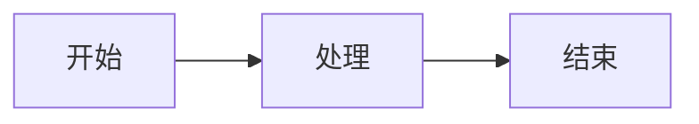

# 🤝 贡献指南

## 🎯 贡献方式

感谢你对考勤管理系统项目的兴趣！我们欢迎各种形式的贡献，包括但不限于：

- 🐛 **Bug报告** - 发现问题并提供详细信息
- 💡 **功能建议** - 提出新功能想法和改进建议
- 📝 **文档改进** - 完善项目文档和注释
- 🔧 **代码贡献** - 修复Bug、实现新功能
- 🧪 **测试完善** - 编写和改进测试用例
- 🎨 **UI/UX改进** - 优化用户界面和体验

## 🚀 快速开始

### 1. 环境准备

在开始贡献前，请确保你已经：

```bash
# 1. Fork项目到你的GitHub账号
# 2. 克隆Fork的项目
git clone https://github.com/YOUR_USERNAME/Kaoqin_Demo.git
cd Kaoqin_Demo

# 3. 添加上游仓库
git remote add upstream https://github.com/KangJianLin/Kaoqin_Demo.git

# 4. 安装开发环境
# 参考 docs/development/setup.md
```

### 2. 创建特性分支

```bash
# 从main分支创建新分支
git checkout main
git pull upstream main
git checkout -b feature/your-feature-name

# 或者修复Bug
git checkout -b bugfix/issue-number-description
```

### 3. 开发和测试

```bash
# 进行开发...

# 运行测试确保没有问题
cd backend && pytest
cd frontend && npm test

# 检查代码质量
cd backend && flake8 app/
cd frontend && npm run lint
```

### 4. 提交代码

```bash
# 添加更改
git add .

# 提交更改（参考提交规范）
git commit -m "feat: 添加用户批量导入功能"

# 推送到你的Fork
git push origin feature/your-feature-name
```

### 5. 创建Pull Request

1. 在GitHub上打开你Fork的仓库
2. 点击 "Compare & pull request"
3. 填写PR模板内容
4. 等待代码审查

## 📋 代码规范

### Python代码规范 (后端)

```python
# 1. 使用Black格式化代码
black app/ tests/

# 2. 遵循PEP 8规范
flake8 app/

# 3. 类型注解
from typing import Optional, List

def get_users(limit: int = 10) -> List[User]:
    """获取用户列表"""
    return db.query(User).limit(limit).all()

# 4. 文档字符串
def create_task(task_data: TaskCreate) -> Task:
    """
    创建新任务
    
    Args:
        task_data: 任务创建数据
        
    Returns:
        Task: 创建的任务对象
        
    Raises:
        ValidationError: 数据验证失败
    """
    pass
```

### TypeScript代码规范 (前端)

```typescript
// 1. 使用Prettier格式化
npm run format

// 2. 遵循ESLint规则
npm run lint

// 3. 类型安全
interface User {
  id: number;
  name: string;
  email: string;
}

// 4. 组合式API
export const useUsers = () => {
  const users = ref<User[]>([]);
  
  const fetchUsers = async (): Promise<void> => {
    try {
      const { data } = await api.users.list();
      users.value = data.data.items;
    } catch (error) {
      console.error('获取用户失败:', error);
    }
  };
  
  return { users, fetchUsers };
};
```

### 提交信息规范

遵循 [Conventional Commits](https://www.conventionalcommits.org/) 规范：

```
<type>[optional scope]: <description>

[optional body]

[optional footer(s)]
```

**类型说明:**
- `feat`: 新功能
- `fix`: Bug修复  
- `docs`: 文档更新
- `style`: 代码格式调整
- `refactor`: 重构代码
- `test`: 添加或修改测试
- `chore`: 构建过程或辅助工具变动

**示例:**
```bash
feat(auth): 添加JWT刷新令牌功能

实现自动刷新访问令牌的机制，提高用户体验。

Closes #123
```

## 🧪 测试规范

### 后端测试

```python
# tests/api/test_tasks.py
import pytest
from httpx import AsyncClient

@pytest.mark.asyncio
async def test_create_task(client: AsyncClient, admin_token: str):
    """测试创建任务"""
    task_data = {
        "title": "测试任务",
        "description": "这是一个测试任务",
        "taskType": "repair",
        "priority": "medium"
    }
    
    response = await client.post(
        "/api/v1/tasks/repair",
        json=task_data,
        headers={"Authorization": f"Bearer {admin_token}"}
    )
    
    assert response.status_code == 200
    data = response.json()
    assert data["success"] is True
    assert data["data"]["title"] == "测试任务"

# 测试覆盖率要求: >90%
pytest --cov=app --cov-report=html --cov-fail-under=90
```

### 前端测试

```typescript
// tests/composables/useAuth.spec.ts
import { describe, it, expect, vi } from 'vitest';
import { useAuth } from '@/composables/useAuth';

describe('useAuth', () => {
  it('应该正确处理登录流程', async () => {
    const { login, user, isAuthenticated } = useAuth();
    
    // Mock API响应
    vi.mocked(api.auth.login).mockResolvedValue({
      data: { success: true, data: { user: mockUser, accessToken: 'token' } }
    });
    
    await login({ studentId: '123', password: 'pass' });
    
    expect(isAuthenticated.value).toBe(true);
    expect(user.value).toEqual(mockUser);
  });
});
```

## 📝 文档贡献

### 文档结构

```
docs/
├── README.md                   # 文档中心首页
├── api/                       # API相关文档
├── development/               # 开发相关文档
└── reports/                   # 系统报告
```

### 文档写作规范

1. **Markdown格式**: 使用标准Markdown语法
2. **标题层级**: 合理使用H1-H6标题
3. **代码块**: 指定语言以启用语法高亮
4. **链接**: 使用相对路径链接其他文档
5. **图表**: 优先使用Mermaid图表
6. **示例**: 提供完整可运行的代码示例

```markdown
# 标题示例

## 功能说明

这是功能说明文本。

### 代码示例

```python
def example_function():
    """示例函数"""
    return "Hello World"
```

### 流程图


```

## 🔍 代码审查

### PR审查清单

**功能性:**
- [ ] 功能按预期工作
- [ ] 边界情况处理正确
- [ ] 错误处理完善
- [ ] API响应格式统一

**代码质量:**
- [ ] 代码风格符合项目规范
- [ ] 变量命名清晰
- [ ] 函数职责单一
- [ ] 注释和文档完善

**测试:**
- [ ] 新功能有对应测试
- [ ] 测试覆盖率达标
- [ ] 测试用例充分
- [ ] 集成测试通过

**性能:**
- [ ] 没有明显的性能问题
- [ ] 数据库查询优化
- [ ] 内存使用合理
- [ ] 响应时间可接受

### 审查流程

1. **自动检查** - CI/CD自动运行测试和代码检查
2. **人工审查** - 至少一名维护者进行代码审查
3. **讨论和修改** - 根据反馈进行讨论和修改
4. **合并** - 审查通过后合并到主分支

## 🚀 发布流程

### 版本管理

使用 [Semantic Versioning](https://semver.org/) 语义化版本：

- **主版本号** (MAJOR): 不兼容的API修改
- **次版本号** (MINOR): 向下兼容的功能添加
- **修订号** (PATCH): 向下兼容的Bug修复

```bash
# 示例版本号
v1.0.0    # 首次发布
v1.1.0    # 添加新功能
v1.1.1    # 修复Bug
v2.0.0    # 破坏性更改
```

### 发布清单

发布前确保：

- [ ] 所有测试通过
- [ ] 文档更新完成
- [ ] CHANGELOG.md更新
- [ ] 版本号正确标记
- [ ] 数据库迁移脚本就绪
- [ ] 部署脚本测试通过

## 🎯 贡献指南

### 新功能开发

1. **需求讨论** - 在Issue中讨论功能需求
2. **设计方案** - 提供技术方案和API设计
3. **开发实现** - 分步骤实现功能
4. **测试验证** - 编写完整测试用例
5. **文档更新** - 更新相关文档
6. **代码审查** - 提交PR进行审查

### Bug修复

1. **问题确认** - 确认Bug的重现步骤
2. **根因分析** - 找出问题的根本原因
3. **修复实现** - 实现最小化修复
4. **测试验证** - 确保修复有效且无副作用
5. **回归测试** - 运行相关测试套件

### 性能优化

1. **性能分析** - 使用工具分析性能瓶颈
2. **优化方案** - 设计优化策略
3. **基准测试** - 建立性能基准
4. **优化实现** - 实施优化方案
5. **效果验证** - 验证优化效果

## 📞 获取帮助

### 交流渠道

- **GitHub Issues** - Bug报告和功能请求
- **GitHub Discussions** - 技术讨论和问答
- **Pull Request** - 代码审查和讨论

### 常见问题

**Q: 如何搭建开发环境？**
A: 参考 [setup.md](setup.md) 文档

**Q: 如何运行测试？**
A: 后端：`pytest`，前端：`npm test`

**Q: 如何生成API文档？**
A: 启动后端服务后访问 http://localhost:8000/docs

**Q: 如何贡献文档？**
A: 编辑相应的Markdown文件并提交PR

### 联系方式

- 项目维护者: [@KangJianLin](https://github.com/KangJianLin)
- 项目主页: https://github.com/KangJianLin/Kaoqin_Demo
- 问题反馈: https://github.com/KangJianLin/Kaoqin_Demo/issues

## 🏆 贡献者

感谢所有为项目做出贡献的开发者！

<!-- 贡献者列表会自动更新 -->

---

**记住：每一个贡献都很有价值，无论大小！** 🌟

我们致力于打造一个友好、包容的开源社区，欢迎所有人参与贡献。
